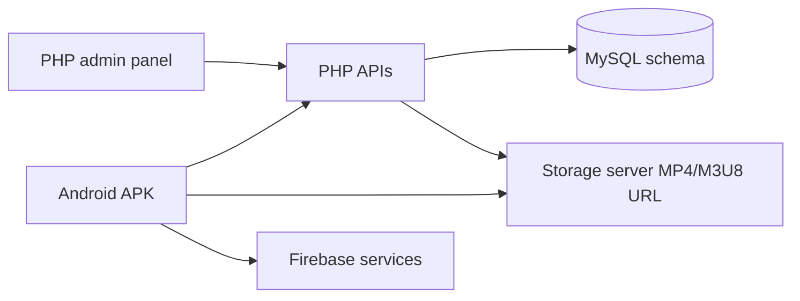

# Legacy review

This review is based on the supplied PHP admin/API project, SQL dump, Android source, and APK. The legacy system remains unchanged.

## Current architecture

The old system stores episode media paths in the database and returns them to the application. Access is represented by direct user grants and group membership/group-video records. The dashboard manually manages users, groups, episodes, banners, notifications, APK updates, and subscriptions.

## Business rules preserved in the redesign

- A customer account can be active, suspended, or disabled.
- Staff can grant access directly to a user or through an access group.
- Grants have a start and end date.
- A drama contains seasons; a season contains ordered episodes.
- An episode can be published or withheld.
- Staff need dashboards, user management, content management, group management, notifications, reports, and audit history.
- Payment may remain manual initially, but a payment record and staff audit event must be created for every access change.

## High-risk findings

| Area | Finding | Consequence | Required redesign |
|---|---|---|---|
| Media | Episode records contain raw MP4/M3U8 paths and the app can receive them | A valid response can be copied outside the app | Store an encrypted provider locator; return only a short-lived gateway capability |
| Client trust | The APK contains reusable API/Firebase material | Reverse engineering exposes credentials usable outside the app | Keep all signing, provider, and Firebase-admin secrets on servers; rotate old secrets |
| Offline | The app stores playable video data in private app storage without content DRM | Rooted devices, backups, modified builds, or runtime instrumentation can extract it | Disable premium offline; otherwise use Widevine offline licenses |
| API authorization | Several legacy endpoints rely on client-supplied IDs or do not share one authorization layer | IDOR/BOLA, mass assignment, and function-level authorization risk | Derive identity from verified token; use policy checks inside services and role/permission guards |
| Account actions | Legacy account deletion/password reset flows accept user-controlled identifiers without a strong proof step | Account takeover or destructive actions | Require authenticated session, re-authentication, OTP/recovery token, and audit event |
| Uploads | Legacy upload handling accepts broad file types and public upload paths | Stored XSS, malware, overwrite, arbitrary file hosting, and resource exhaustion | Private object storage, allowlisted MIME/content signatures, generated keys, size quotas, malware scanning |
| Errors/config | Debug output, broad CORS, and secrets in source/config are present | Sensitive data exposure and cross-origin abuse | Production-safe errors, exact CORS allowlist, external secrets, rotation |
| Admin access | Session-based panel access is not enough by itself for a valuable content library | Credential theft or staff abuse can expose all content | MFA, RBAC/permissions, IP/device controls, re-authentication for high-risk actions, immutable audit logs |

## Database redesign reasons

The old schema uses integer IDs, duplicated relationships, string enums, raw URL fields, and very large view-log inserts. The new model uses UUIDs, foreign keys, unique constraints, explicit grants, soft deletion, time-bounded sessions, and indexes for the entitlement query. Analytics should be append-only and partitioned/aggregated when volume grows; it must not block playback authorization.

## Performance risks addressed

- Entitlement checks are indexed by user, group, episode, status, and time window.
- Content listing APIs use cursor pagination and bounded page sizes.
- DTOs select only fields needed for the response.
- Playback authorization is one bounded database query plus one short session insert.
- Redis is reserved for rate-limit counters, revoked-session cache, and read-heavy catalog data; it is not the source of truth for entitlement.
- Long-running media bytes do not pass through the main API process.
