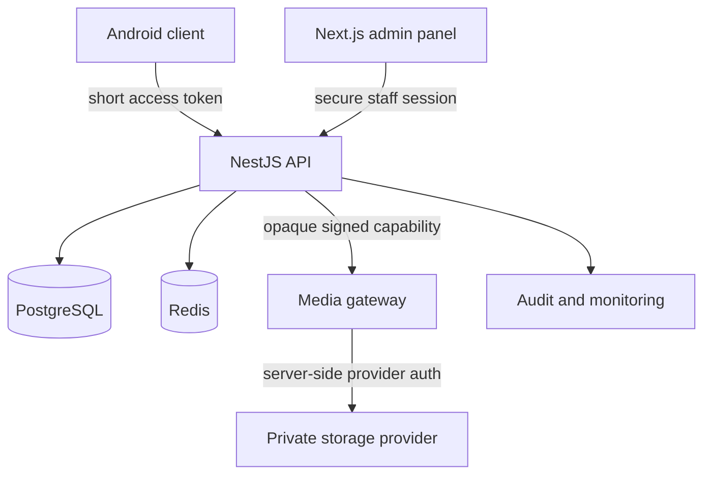

# Security architecture

## Trust model

Assume the mobile app, browser, APK, device storage, network client, and every request parameter are hostile. The trusted components are the backend, PostgreSQL, Redis used only for bounded supporting state, the secret manager, and the media gateway/provider connection.

## Playback sequence

1. The client authenticates and receives a short-lived access token plus a refresh token. The refresh token is stored in platform-protected storage and is never logged.
2. The client requests `POST /api/v1/playback/episodes/{episodeId}/session`.
3. The API verifies the access token, session, account status, device policy, published state, episode existence, direct grant/group grant, and time window.
4. The API records a playback session with user, device, IP, user-agent, and expiry.
5. The API returns a short-lived gateway URL containing an opaque asset ID and signed capability. It never returns the provider locator.
6. The media gateway verifies the signature, expiry, session state, and asset policy, then obtains the provider stream server-side.
7. The player uses HLS/DASH. Premium content should use Widevine DRM. A visible per-user watermark should be rendered by the player or packaging pipeline for leak attribution.

## Authentication and authorization

- Access tokens: RS256, 5-10 minutes, issuer and audience validation, `sub` user UUID, `sid` server session UUID, and role only.
- Refresh tokens: random, high-entropy, stored only as SHA-256 hashes; rotated on every use; old token revoked; reuse detection revokes the entire token family.
- Passwords: Argon2id with calibrated memory/time parameters; generic login errors and rate limits; no password in logs.
- Roles: `SUPER_ADMIN`, `ADMIN`, `SUB_ADMIN`, `MODERATOR`, `USER` are a coarse boundary only. Sensitive actions require explicit permissions, object-level checks, and audit records.
- Account state is rechecked server-side. A suspended account cannot continue using a previously issued access token.

## OWASP API Security Top 10 controls

| Risk | Control in this design |
|---|---|
| API1 BOLA | UUID resources, service-level ownership/entitlement predicates, no client-selected actor IDs |
| API2 broken authentication | Argon2id, short access TTL, refresh rotation, generic errors, session revocation, MFA for staff |
| API3 property authorization | Strict DTOs with whitelist and `forbidNonWhitelisted`; response DTOs instead of ORM objects |
| API4 resource consumption | Global and route-specific rate limits, body limits, pagination caps, upload quotas, query timeouts |
| API5 function authorization | Global auth guard plus explicit permission guard and role checks on admin routes |
| API6 sensitive business flows | Login, password recovery, access grants, playback, and uploads have separate throttles and anomaly alerts |
| API7 SSRF | Do not fetch arbitrary admin-supplied URLs; accept provider asset IDs or allowlisted hosts and resolve through a fixed adapter |
| API8 misconfiguration | Fail-fast environment validation, Helmet, strict CORS, no production stack traces, private Swagger |
| API9 inventory | Versioned route registry, deprecation policy, OpenAPI review, no debug/test endpoints in production |
| API10 unsafe API consumption | Signed provider requests, timeouts, response-size limits, allowlisted hosts, schema validation, and provider isolation |

## Upload policy

Uploads are intentionally not part of the first public API surface. When added, use direct-to-private-object-storage multipart upload with a one-time upload intent. The API must validate size and declared type; the worker must verify magic bytes, transcode/package media, scan it, remove metadata where appropriate, and publish only after review. Object keys are server-generated UUIDs; original filenames are metadata only.

## Logging and privacy

Log request ID, route, status, latency, actor UUID when known, outcome, and a privacy-reviewed IP/user-agent representation. Never log passwords, raw refresh tokens, JWTs, provider URLs, media gateway signatures, or full request bodies. Audit events are append-only and sent to a separate retention/alerting pipeline.

## What this cannot promise

No Android app can make screen recording or extraction impossible on a rooted or fully controlled device. The design reduces value of leaked credentials/URLs, expires capabilities quickly, prevents direct origin access, supports DRM, and provides user-level leak attribution.
